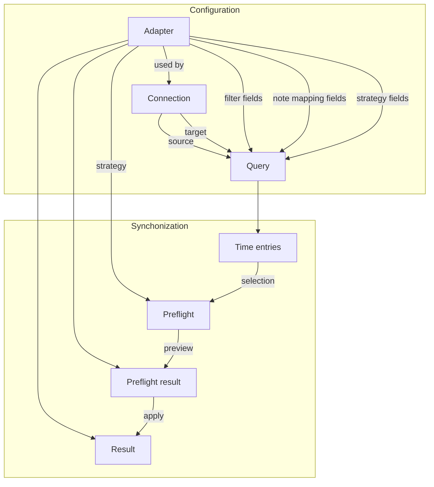

# Time Shift

Time Shift collects time entries from various sources and maps them into configured targets.

## Node

Ensure to have the right node version installed and active.

We highly recommend to use [nvm](https://github.com/nvm-sh/nvm), the version to be used can be found in the [.nvmrc](.nvmrc) file.

## Dependencies

Install dependencies with [pnpm](https://pnpm.js.org/):

```bash
$ pnpm -r install
```

## Build, Test, Run

Each package can be built, tested and run individually.
Just add a filter to the command to only run it on a specific package: `pnpm -r <command> --filter <package-name>`.

### Build

```bash
$ pnpm --recursive build
```

### Test

```bash
$ pnpm --recursive test
```

### Run

```bash
$ pnpm --recursive --parallel dev
```

## Structure and terminology



### Adapters

Are provided at runtime by Time Shift. They can be used to access APIs or to convert data. They conveniently deliver and receive time entries in a common format.

### Connections

Are used to connect to the adapters by providing necessary credentials. Multiple connections can use the same adapter.

### Queries

Use connections to define inputs and filter fields. Each configuration requires to have a source connection to be defined which delivers the available filters.

### Filters

Individual filters can be configured to narrow the set of time entries. Each configuration has its own filters based on the selected source connection adapter type.

### Time entries

By selecting a configuration the resulting time entries can be loaded. This data set can be filtered and individual entries selected for further interactions.

### Synchonization

Are configured by selecting a strategy provided by the target adapter. Once configured, the selected time entries can proceed a three stage process:

- Preflight of the synchronization
- Preview of the actions to be made
- Apply the changes (perform the synchronization)

#### Strategy

Time entries can be mapped to targets by using a strategy. The strategy defines how the mapping is done and is provided by the target adapter.

#### Preflight

Before synchronizing time entries, a preflight check is performed to ensure that the time entries can be mapped to the target adapter. Thus, a preview of the actions to be made is provided and can be aligned before applying the changes.

## UI

- Left sidebar:
  - Configured Connections
  - Configured Queries
- Main view (if query selected):
  - List of (filtered) time entries
  - Actions (**sync**, align times, delete, ...)
